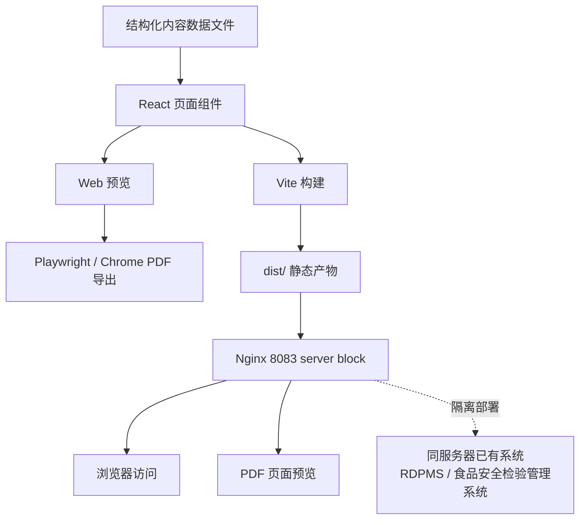

# 00_ARCHITECTURE_OVERVIEW.md

## 1. 文档信息

| 项目 | 内容 |
|---|---|
| 文档名称 | Digifluidic Brochure Builder 总体架构概览 |
| 文件路径 | `docs/01_architecture/00_ARCHITECTURE_OVERVIEW.md` |
| 所属目录 | `docs/01_architecture/` |
| 文档类型 | 架构基准文档 |
| 适用范围 | 前端架构、内容数据流、PDF 导出、本地开发、部署隔离、后续架构细化 |
| 当前版本 | v0.1 |
| 维护方式 | 随前端骨架、内容模型、PDF 导出和部署方案变化持续更新 |

## 2. 架构文档目的与适用范围

本文件用于：

1. 统一项目整体技术架构认知；
2. 说明为什么当前阶段采用纯前端静态站点；
3. 作为后续技术栈、目录结构、路由与渲染、内容模型、PDF 导出和部署文档的上位说明；
4. 帮助执行型 AI 助手在生成代码和文档时遵守架构边界；
5. 帮助新加入的工程师或 AI 对话快速理解项目实现方式。

本文件不用于替代：

1. 详细技术栈说明（`01_TECH_STACK.md`）；
2. 详细目录结构说明（`02_DIRECTORY_STRUCTURE.md`）；
3. 具体组件设计文档；
4. PDF 导出脚本规范（`docs/06_pdf_export/`）；
5. Windows Nginx 部署操作手册（`docs/05_deployment/`）；
6. 医疗器械注册资料或正式产品资料。

## 3. 项目整体架构定位

Digifluidic Brochure Builder 的整体定位：

1. 这是一个用于生成和维护 Digifluidic 白皮书/宣传册的前端工程项目；
2. 主要输出包括网页预览和 A4 PDF 导出；
3. 项目面向内部维护和对外材料生成，而不是在线业务系统；
4. 当前阶段不提供后台管理、用户登录、数据库存储或服务端 API；
5. 文档和内容采用结构化方式维护；
6. 前端组件负责将结构化内容渲染为网页和可打印页面；
7. PDF 导出基于浏览器渲染结果完成；
8. 部署方式为静态资源托管。

**架构一句话描述：**

```text
本项目采用"结构化内容数据 + React 组件渲染 + Vite 静态构建 + Playwright/Chrome PDF 导出 + Nginx 静态托管"的轻量级前端架构。
```

## 4. 总体架构图



## 5. 纯前端静态站点架构

当前采用纯前端静态站点的原因：

1. 宣传册和白皮书以展示、打印和版本化维护为主；
2. 当前不需要用户登录、权限控制或在线编辑；
3. 内容量可通过结构化文件维护，无需数据库或 CMS；
4. 静态站点部署简单、稳定、易于隔离；
5. 减少对服务器现有系统的影响；
6. 降低运维复杂度；
7. 便于通过 Git 管理版本。

当前不包含：

1. 后端 API；
2. 数据库；
3. 用户登录；
4. CMS；
5. 在线编辑器；
6. PM2 服务管理；
7. Docker；
8. Kubernetes；
9. 与 RDPMS 或其他业务系统的深度集成。

## 6. 技术栈角色分工

| 技术/工具 | 项目内角色 | 使用阶段 | 注意事项 |
|---|---|---|---|
| React | 组件化页面渲染 | 开发、构建 | 仅用于静态前端，不引入后端 |
| Vite | 本地开发服务与构建工具 | 开发、构建、预览 | 影响构建行为和开发体验 |
| TypeScript | 类型约束与数据文件维护 | 开发、构建 | 用于组件和数据文件的类型安全 |
| Tailwind CSS | 原子化样式方案 | 开发、构建 | 需同时兼顾屏幕展示和打印样式 |
| Playwright | 自动化 PDF 导出 | PDF 导出 | 重点关注分页、字体和背景图形 |
| Chromium | Playwright 使用的浏览器内核 | PDF 导出 | 提供 PDF 渲染能力 |
| Chrome 打印 | PDF 导出手动兜底方案 | PDF 导出 | 适合手动校验和备用导出 |
| Nginx | 静态资源托管与访问转发 | 部署 | Windows Server 上需独立配置 |
| Windows Server | 目标部署环境 | 部署 | 需与已有系统隔离 |
| Git | 版本记录与协作 | 全程 | 按阶段提交 |
| npm | 依赖安装与脚本运行 | 开发、构建 | 安装、启动和构建命令入口 |
| VS Code | 开发环境 | 开发 | 当前项目主要编辑器 |
| Monica / CodeBuddy / Copilot | 执行型 AI 辅助生成与修改 | 文档编写、代码生成 | 不得改变项目架构边界 |

## 7. 内容数据流

从内容维护到页面输出的整体流程：

1. 当前阶段以 `src/data/brochure.ts` 作为主内容数据源。后续如需多语言或非开发人员维护内容，可再评估 JSON 内容文件或其他扩展形式；
2. 数据文件包含白皮书章节、应用矩阵、论文证据链、产品生态、合规声明等内容；
3. React 组件读取这些数据；
4. 页面组件负责根据内容类型渲染封面、章节页、应用矩阵、论文列表、产品生态、合规声明等；
5. 浏览器中形成 Web 预览；
6. 同一套页面通过打印样式或 PDF 导出流程生成 A4 PDF；
7. PDF 导出后进入 QA 检查和版本归档。


## 8. 页面渲染架构

页面渲染的基本思路：

1. 页面以白皮书/宣传册为主线组织；
2. 采用组件化页面结构；
3. 第一版必需组件：
   - `BrochureLayout`：整体布局容器
   - `CoverPage`：封面页
   - `ExecutiveSummary`：执行摘要
   - `PlatformOverview`：平台概述
   - `ProductEcosystem`：产品生态展示
   - `TechnologyRoutes`：技术路线
   - `ApplicationMatrix`：应用矩阵
   - `PaperEvidenceList`：论文证据链列表
   - `ComplianceNotice`：合规声明
   - `ContactAndFooter`：联系方式与页脚
4. 页面结构应同时服务于网页预览和 PDF 导出；
5. 页面组件不应硬编码大段内容，应优先从数据文件读取；
6. 与合规有关的文案应集中维护，避免散落在多个组件中；
7. 打印相关样式应与普通屏幕样式区分但保持一致口径。

## 9. PDF 导出架构

PDF 导出不是单独手工排版文件，而是基于网页渲染结果导出：

1. 自动导出推荐使用 Playwright；
2. Playwright 启动或访问本地预览页面；
3. 使用 Chromium 的 PDF 能力生成 A4 PDF；
4. Chrome 浏览器打印作为手动兜底方案；
5. PDF 样式需要专门处理打印样式、分页、页边距、字体和背景图形；
6. PDF 导出后需要 QA 检查。

**PDF 导出链路：**

```text
结构化内容 → React 页面 → 浏览器渲染 → 打印样式 → Playwright/Chrome → A4 PDF → QA 检查 → 版本归档
```

PDF QA 至少检查：

1. 封面完整性；
2. 页码；
3. 章节断点；
4. 表格是否跨页异常；
5. 图表是否被截断；
6. 中文字体；
7. 品牌色；
8. 联系方式；
9. 合规声明；
10. 文件名规范。

## 10. 本地开发、构建与预览流程

典型本地流程：

1. 使用 VS Code 维护文档和代码；
2. 使用 npm 安装依赖；
3. 使用 Vite 启动本地开发服务；
4. 在浏览器中查看 Web 预览；
5. 使用构建命令生成 `dist/`；
6. 使用本地预览检查构建结果；
7. 使用 Playwright 或 Chrome 导出 PDF；
8. 使用 Git 记录关键阶段。

相关命令将在后续前端骨架完成后配置，当前架构文档只定义流程：

```text
npm install
npm run dev
npm run build
npm run preview
npm run export:pdf
```

## 11. 部署架构

目标部署环境：

1. 腾讯云 Windows Server；
2. Nginx 静态托管；
3. 推荐部署目录：`C:\digifluidic-brochure`；
4. 推荐 WebRoot：`C:\digifluidic-brochure\dist`；
5. 推荐端口：`8083`；
6. 访问形式：`http://服务器IP:8083`；
7. 与已有系统保持隔离。

Nginx 参考配置：

```nginx
server {
    listen 8083;
    server_name _;
    root C:/digifluidic-brochure/dist;
    index index.html;
    location / {
        try_files $uri $uri/ /index.html;
    }
}
```

说明：
- Windows 路径在 Nginx 中建议使用正斜杠；
- `try_files` 可支持 React Router 或前端路由回退；
- 不应修改已有系统的端口和 server block；
- 部署时应先检查配置再 reload。

## 12. 与已有系统的隔离原则

服务器上已有系统包括但不限于：

1. RDPMS 系统；
2. 食品安全检验管理系统；
3. 其他可能已经通过 Nginx 或 PM2 运行的服务。

本项目应遵循：

1. 使用独立目录（`C:\digifluidic-brochure`）；
2. 使用独立端口（8083）；
3. 使用独立 Nginx server block；
4. 不复用已有系统的构建目录；
5. 不修改已有系统配置；
6. 不占用已有服务端口；
7. 不与已有数据库或后端服务集成；
8. 不在当前阶段引入 PM2；
9. 出现端口冲突时，优先调整本项目端口，而不是已有系统端口。

## 13. 当前阶段不纳入范围

明确当前阶段不纳入：

1. 后端 API；
2. 数据库；
3. 用户登录；
4. 权限管理；
5. CMS；
6. 在线编辑器；
7. 多用户协同编辑；
8. 服务器端 PDF 渲染服务；
9. PM2；
10. Docker；
11. Kubernetes；
12. 复杂数据可视化后台；
13. 与 RDPMS 或其他系统深度集成；
14. 自动联网抓取论文；
15. 自动同步论文数据库。

以上可作为未来扩展设想，但不进入当前架构版本。

## 14. 架构约束与设计原则

1. 先静态、后扩展：优先保证纯前端静态站点可用，再评估扩展方向；
2. 先文档主干、后前端骨架：在文档体系建立后再启动前端代码；
3. 先结构化内容、后视觉优化：优先定义数据结构和内容模型，再调整页面视觉；
4. 先 Web 预览、后 PDF 精修：先保证网页效果可接受，再打磨 PDF 导出质量；
5. 先本地可构建、后服务器部署：本地构建预览通过后再考虑部署；
6. 先隔离部署、后考虑集成：优先保证独立运行，不与现有系统耦合；
7. 合规文案集中维护：合规声明和边界说明应在数据文件中集中定义；
8. 不因短期便利引入后端和数据库；
9. 关键文件完成后必须更新 `PROJECT_CONTEXT.md`；
10. 所有架构变更应可追溯，建议通过 Git 提交记录和文档版本号管理。

## 15. 后续可扩展方向

在不改变当前阶段边界的前提下，未来可能扩展：

1. 多语言内容数据结构；
2. 多版本白皮书导出；
3. 客户版材料裁剪；
4. 更多图表组件；
5. 论文数据 schema 扩展；
6. 组件库标准化；
7. 自动化 PDF QA；
8. 部署脚本自动化；
9. 更严格的版本归档；
10. 后续如确有必要再评估 CMS 或后端，但当前不引入。

注意：未来扩展只作为可能方向，不得写成本阶段任务。

## 16. 架构决策记录

| 编号 | 决策 | 原因 | 当前状态 |
|---|---|---|---|
| ADR-001 | 采用纯前端静态站点 | 宣传册以展示和打印为主，无需在线业务系统；降低部署和运维复杂度 | 已确定 |
| ADR-002 | 使用 React | 组件化适合页面结构复用，生态成熟 | 已确定 |
| ADR-003 | 使用 Vite | 开发体验好、构建速度快，适合静态站点 | 已确定 |
| ADR-004 | 使用 TypeScript | 提供类型约束，便于维护数据文件和组件结构 | 已确定 |
| ADR-005 | 使用 Tailwind CSS | 原子化方案适合快速构建页面，可搭配打印样式 | 已确定 |
| ADR-006 | 使用 Playwright 做 PDF 自动导出 | 可编程控制导出参数，支持 A4 输出 | 已确定 |
| ADR-007 | 使用 Chrome 打印作为兜底 | 手动操作简单，适合校验和备用导出 | 已确定 |
| ADR-008 | 使用 Nginx 静态托管 | 轻量、稳定，Windows Server 可用 | 已确定 |
| ADR-009 | 使用 8083 端口 | 避免与已有系统端口冲突 | 已确定 |
| ADR-010 | 当前不引入后端 | 宣传册无需在线业务逻辑，减少维护成本 | 已确定 |
| ADR-011 | 当前不引入数据库 | 内容量适合用结构化文件维护 | 已确定 |
| ADR-012 | 当前不引入 CMS | 结构化文件 + Git 版本管理已满足当前需求 | 已确定 |
| ADR-013 | 当前不使用 PM2 | 静态站点无需进程管理 | 已确定 |
| ADR-014 | 当前不使用 Docker/Kubernetes | 静态站点部署简单，容器化增加不必要的复杂度 | 已确定 |
| ADR-015 | 与现有服务器系统隔离部署 | 避免影响已有业务系统，降低部署风险 | 已确定 |

## 17. 风险与控制措施

| 风险 | 影响 | 控制措施 |
|---|---|---|
| PDF 分页不稳定 | 导出质量差，影响专业形象 | 提前测试打印样式；Playwright 设置分页参数；QA 检查每个版本 |
| 中文字体渲染不一致 | PDF 中文字体异常或缺失 | 指定 Web 安全字体或引入字体文件；导出前检查字体嵌入 |
| 表格或图表跨页被截断 | 内容不完整，影响阅读体验 | 使用 CSS `page-break-inside` 控制；QA 逐页检查 |
| 内容散落在组件中导致维护困难 | 修改一处需要翻多个组件 | 集中维护结构化数据文件；组件只负责渲染 |
| 执行型 AI 擅自引入后端或数据库 | 架构偏离当前方案 | Prompt 中明确禁止；`PROJECT_CONTEXT.md` 中记录架构边界 |
| Nginx 配置误影响已有系统 | 已有业务中断 | 使用独立 server block 和端口；修改后先测试再 reload |
| 端口冲突 | 本项目或已有系统无法访问 | 预先确认端口占用；默认使用 8083 |
| `PROJECT_CONTEXT.md` 未及时更新 | AI 协作上下文过期，产生错误建议 | 关键文件完成后强制同步更新 |
| 文献证据链被写成产品性能承诺 | 合规风险，可能误导受众 | 合规文案集中维护；发布前审阅 |
| 上传/读取文件时被系统压缩成英文摘要 | 审阅基于不完整内容，产生误判 | 严格审阅时优先粘贴文件全文或关键章节；不以 compressed summary 作为正式审阅依据；本地真实文件以 VS Code 中内容为准 |

## 18. 与其他文档的关系

| 文档 | 关系 |
|---|---|
| `PROJECT_CONTEXT.md` | 项目上下文锚点，本文件是其架构层面的细化 |
| `docs/00_project/01_PRD.md` | 需求范围与功能边界，本文件是其技术实现方案 |
| `docs/00_project/02_ROADMAP.md` | 阶段划分与里程碑，本文件服务于阶段 3-6 |
| `docs/00_project/03_GLOSSARY.md` | 术语统一参考，本文件中的技术术语应与之一致 |
| `docs/01_architecture/01_TECH_STACK.md` | 本文件第 6 节的详细展开 |
| `docs/01_architecture/02_DIRECTORY_STRUCTURE.md` | 本文件第 8 节和第 10 节的目录层面细化 |
| `docs/01_architecture/03_ROUTE_AND_RENDERING.md` | 本文件第 7 节和第 8 节的路由与渲染层面细化 |
| `docs/02_content/00_CONTENT_STRATEGY.md` | 本文件第 7 节内容数据流的内容组织依据 |
| `docs/02_content/01_CONTENT_MODEL.md` | 本文件第 7 节中结构化数据文件的 schema 定义 |
| `docs/03_design/00_DESIGN_GUIDELINE.md` | 本文件第 8 节和第 9 节的视觉与打印设计规范 |
| `docs/05_deployment/01_WINDOWS_NGINX_DEPLOYMENT.md` | 本文件第 11 节和第 12 节的部署操作细化 |
| `docs/06_pdf_export/00_PDF_EXPORT_OVERVIEW.md` | 本文件第 9 节的 PDF 导出方案细化 |
